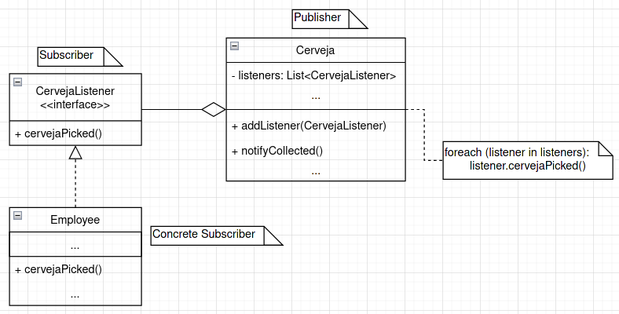
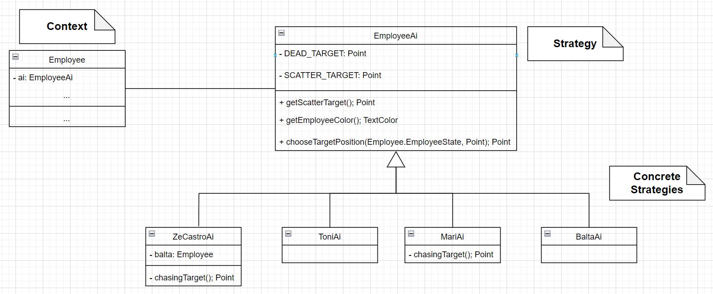
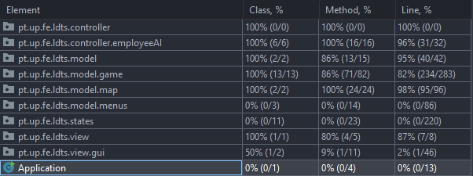

# ldts-project-assignment-g1302
# Wagga-wagga

## Game Description

This project is a mock of the famous arcade game Pac-Man, developed by [Bandai Namco](https://en.bandainamcoent.eu/).

 

 

 

The player will control __Jorge__, a man that navigates through a bar filled with ___tremoços___, an exotic piece of food that's rarely seen around. __Jorge__'s goal is to eat all the ___tremoços___ available to him. However, there are 4 employees, __Toni__, __Zé Castro__, __Baltazar__ and __Mariana__, that do not like to see __Jorge__ in the bar because he leaves no ___tremoços___ for the rest of the clients. But there's a catch: there are ___cervejas___, a special drink that, when taken, make the person incredibly strong, so strong that no one, including bar employees, dare to approach them. In fact, if the drinker touches someone they get knocked out, needing some time to rest and regain their energy.
It's Halloween night, so __Jorge__ and the employees are dressed as the characters from Pacman™, __Jorge__ is Pacman, __Toni__ is Clyde, __Zé Castro__ is Inky, __Baltazar__ is blinky and __Mariana__ is pinky.  

 

This project was developed for LDTS 2021/2022 by 
- [Gonçalo Marques](https://github.com/GoncaloMarques-up) (up202006874)
- [Nuno Pereira](https://github.com/Naapperas) (up202007865)
- [Pedro Nunes](https://github.com/pedronunes19) (up202004714)

 

## Implemented Features

- Player-controlled Character (__Jorge__);
- __Jorge__ starts every game with 3 lives, the game ends when his lives reach 0;
- 4 employees (Pac-Man's ghosts) with different characteristics (movement patterns, color, etc...);
- The employees (when not vulnerable) can catch __Jorge__, reseting every employee and the player back to their starting position and states and decrementing __Jorge__'s lives by 1;
- Labyrinth (the ___bar___) made up by walls that the player can't go through;
- Gateways on both lateral sides and/or on the upper and lower borders of the map that allow the player to move from one gateway to the other instantly;
- Rendering of every element of the game (including points and lives) to the screen;
- ___Cervejas___ that act as a powerup to __Jorge__ and make employees vulnerable;
- Ability to "knock out" vulnerable employees, sending them to their starting position and receiving extra points for it;
- The user gets points proportional to the amount of ___tremoços___ he eats plus extra points for every ___cerveja___;
- Timers that cycle the Employees states periodically;
- When all ___tremoços___ are eaten the whole map is loaded again, so the player can keep playing and adding up to the score;
- An initial menu with Play (opens a new menu), Leaderboard (opens the leaderboard) and Quit options;
- A menu to choose the difficulty of the game (Easy, Normal or Hard), each of them corresponding to a different map, with different shapes and sizes, and a variable number of employees;
- A personal leaderboard containing the player's 15 best scores in any map ordered from best to worst;

## Planned features

> All planned features were implemented in the final version of the game.

## Design

### Scared Employees
### Problem in context

We needed to have a way of notifying every Employee when a ___cerveja___ was consumed.

**The Pattern**

We have used the [Observer](https://refactoring.guru/design-patterns/observer) pattern. This pattern allows for an object, called *publisher*, to notify other objects, called *subscribers* of some event. The ***cerveja***s are the publishers and the Employees are the subscribers.

**Implementation**

The following figure shows how the pattern’s roles were mapped to the application classes.

**Consequences**

Using this pattern allows us to make sure that, no matter how many Employees are present at any given time in the game, as long as they are marked as listeners on each ___cerveja___ object, they will be notified when a ___cerveja___ is picked.

### Many Employess

### Problem in context

There are different types of Employees, each with their own way of picking the next cell to target or what color to use when rendering them. However, creating different subclasses of Employee and potentially rewritting the same code in multiple places is bad practice.

**The Pattern**

The design pattern applied is the [Strategy](https://refactoring.guru/design-patterns/strategy) pattern. This way, we can abstract from each Employee the computation of the target location to move to and just move to it, regardless of how it is calculated.

**Implementation**

The following figure shows how the pattern’s roles were mapped to the application classes.

**Consequences**

Using this pattern, we can create many color+movement pattern combinations without the need to re-write how an employee should choose its target.

## Testing

Test Coverage

>Coverage and mutation reports

## Known Code Smells And Refactoring Suggestions

> This section should describe 3 to 5 different code smells that you have identified in your current implementation, and suggest ways in which the code could be refactored to eliminate them. Each smell and refactoring suggestions should be described in its own subsection.

## Self-Evaluation

>Work distribuition between the group members (percentages are enough according to template)

